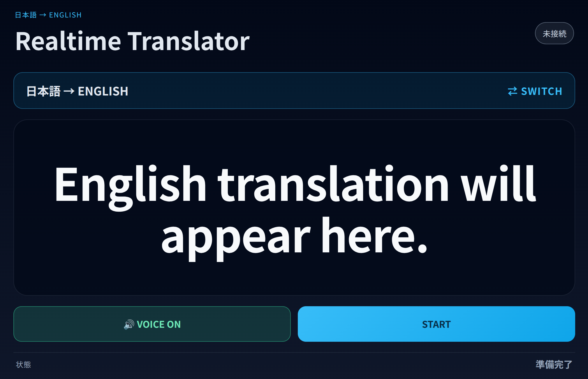

# REALTIME TRANSLATOR

**日本語 ⇄ English のリアルタイム音声翻訳アプリ。**  
OpenAI `gpt-realtime-translate` と WebRTC を使い、話した内容を翻訳音声と字幕で返します。

## 公開版

https://realtime-translator.1bitexist.workers.dev

<p align="center">
  
</p>

## v0.1.0 — STABLE

まず「翻訳方向」を選び、`START` して話すシンプルな構成です。

- 日本語 → English
- English → 日本語
- 翻訳字幕をリアルタイム表示
- 翻訳音声 `VOICE ON / OFF`
- `START / STOP`
- `⇄ SWITCH` で翻訳方向を変更
- 1つの Realtime translation session だけを使用
- OpenAI API key はブラウザへ置かず、Node.js サーバー側だけで保持

## 使い方

### 日本語 → English

1. `日本語 → ENGLISH` を選択
2. `START`
3. 日本語で話す
4. 英語字幕と英語音声で翻訳

### English → 日本語

1. 翻訳中なら `STOP`
2. `⇄ SWITCH` で `ENGLISH → 日本語` に変更
3. `START`
4. Speak English
5. 日本語字幕と日本語音声で翻訳

方向を変えるときは、**STOP → SWITCH → START** の順で操作するのが v0.1.0 の安定した使い方です。

## 構成

```text
Microphone
   ↓
Browser / React
   ↓ WebRTC
OpenAI Realtime Translation
   ↓
Translated audio + translated transcript
```

セッション作成用の短期 client secret だけを Node.js サーバーから取得します。

```text
Browser
   ↓ POST /api/realtime/session
Node.js / Express
   ↓
OpenAI client_secrets API
```

## 技術

- React 18
- Vite 5
- Node.js / Express
- WebRTC
- OpenAI `gpt-realtime-translate`
- PWA manifest

## ローカルで動かす

### 1. Clone

```bash
git clone https://github.com/Masato-Nasu/REALTIME-TRANSLATOR.git
cd REALTIME-TRANSLATOR
```

### 2. Install

```bash
npm install
```

### 3. Environment variables

```bash
cp .env.example .env
```

`.env` を開き、OpenAI API key を設定します。

```env
PORT=3001
OPENAI_API_KEY=YOUR_OPENAI_API_KEY
ALLOWED_ORIGINS=http://localhost:5173
```

> **重要:** `.env` は Git に含めないでください。API key をブラウザ側のコードへ直接書かないでください。

### 4. Start

```bash
npm run dev
```

ブラウザで開きます。

```text
http://localhost:5173/
```

マイクへのアクセスを許可してください。

## npm scripts

```bash
npm run dev          # Node server + Vite client
npm run dev:server   # API server :3001
npm run dev:client   # Vite :5173
npm run build        # frontend build
npm run preview      # Vite preview :4173
npm start            # production Node server
```

## Security

`OPENAI_API_KEY` はサーバー環境だけで使用します。ブラウザは `/api/realtime/session` から短期 client secret を受け取り、その secret で OpenAI Realtime Translation の WebRTC 接続を開始します。

## PWA

`manifest.webmanifest` と PWA icon は含まれています。完全なインストール可能 PWA として公開するには、HTTPS 上でのデプロイと Service Worker の追加・登録が必要です。

---

**REALTIME TRANSLATOR v0.1.0**  
Japanese ⇄ English realtime voice translation.
